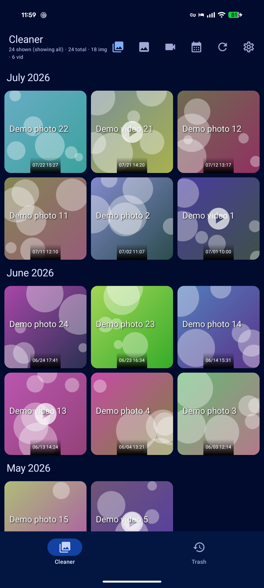
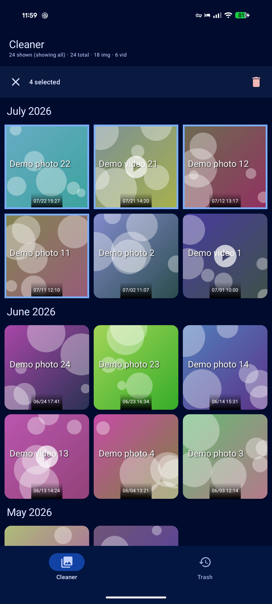
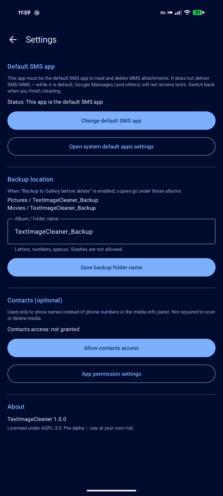
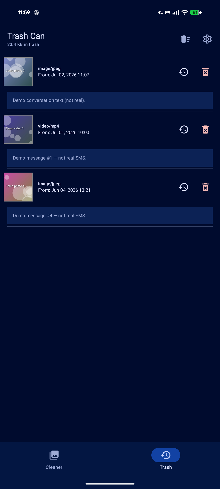

# TextImageCleaner

**Stable 1.0.0** — bulk-clean MMS images and videos on Android 15+.

TextImageCleaner is a Kotlin / Jetpack Compose utility that finds image and video attachments in system MMS storage, shows them in a single grid (grouped by month), and lets you delete them in bulk—either **attachments only** (keep text) or **move media to an in-app Trash** (with careful full-message cleanup).

## Features

- Scan and grid of MMS **images & videos**, grouped by month
- Filters: All / Images / Videos
- Multi-select (long-press, month headers)
- **Date-range delete** (calendar): only months that still have media are selectable
- Delete modes: **attachments only** (keep text) or **trash + message rules** (Option A: full MMS removed only if every media part was selected)
- Optional **backup to Gallery** before delete (album name configurable in Settings)
- **Trash**: original message date/time, message body, restore to Gallery, permanent delete
- **Settings**: default SMS controls, backup folder, optional Contacts for names
- Info panel: lazy load conversation peers + body; optional Contacts permission
- WorkManager background deletion with progress notification
- Predictive back on Settings

## Screenshots

Synthetic demo media only (not real messages).

<p>




</p>

Regenerate: `./scripts/capture-screenshots.sh` (`demo_mode` — never reads real MMS).

> **History:** Early prototypes used Gemini-assisted “vibe coding.” **1.0.0** is a full refactor and stabilization with **[Grok 4.5](https://x.ai)** via **Grok Build** (xAI): safer deletion semantics, settings, date-range delete, tests, and release docs.

## Install

### Download (one APK)

**[TextImageCleaner 1.0.0 — release-signed APK](https://github.com/LinkofHyrule89/TextImageCleaner/releases/tag/v1.0.0)**

There is a **single** installable file on the release: `TextImageCleaner-1.0.0.apk` (release-signed).

```bash
adb install -r TextImageCleaner-1.0.0.apk
```

Or open the APK on the device (allow install from that source if prompted).

Every successful **`master` push** also uploads the same style of **release-signed** APK as the Actions artifact **`TextImageCleaner-release-apk`**. Tag builds attach it to GitHub Releases.

## Why it exists

Google Messages still doesn’t offer a good way to bulk-delete years of MMS photos and videos. System message storage can grow to many gigabytes. This app was built to reclaim that space **with explicit confirmations and safer multi-attachment handling**.

## Requirements

| | |
|--|--|
| OS | **Android 15+** (`minSdk 35`) |
| Role | Temporarily set this app as the **default SMS app** to read/delete MMS |
| Risk | Deleting message media is irreversible at the system level (except in-app Trash restore of **files** to Gallery—not back into SMS) |

While this app is the default SMS handler, **it does not deliver SMS/MMS**. Switch back to Google Messages (or your preferred app) when you finish.

## Safety & privacy

- **No full SMS wipe.** Only URIs you select (or that fall in a date-range snapshot) are processed.  
- **Attachments-only** deletes selected parts only; the text shell remains.  
- **Trash mode** copies media into private app storage first; the whole MMS is deleted only when **all** media parts of that message were selected. Partial multi-media selection never silently deletes sibling attachments.  
- Control messages outside your selection are not modified (covered by instrumented safety tests).  
- Cloud backup excludes trash files and Room DBs (message bodies in trash).  
- Contacts access is **optional** and only for display names in the info panel.  

See [SECURITY.md](SECURITY.md).

## Usage (short)

1. Open the app → set as **default SMS** when prompted → grant permissions.  
2. Browse media; use filters as needed.  
3. Long-press to select, or use the **calendar** for a date range.  
4. Confirm **attachments only** vs trash, optional backup.  
5. When done, open **Settings** and switch the default SMS app back.

## Build from source

```bash
export JAVA_HOME=/path/to/jdk-21   # or 17+
export ANDROID_HOME=/path/to/Android/Sdk
./gradlew assembleDebug
# APK: app/build/outputs/apk/debug/app-debug.apk
```

### Signed release (maintainers)

Signing material is **not** in the repo. Locally:

1. Keep the keystore private (e.g. `~/.config/textimagecleaner-signing/`).  
2. Create gitignored `keystore.properties` from `keystore.properties.example`, or export:

```bash
export KEYSTORE_PATH=/path/to/textimagecleaner-release.jks
export KEYSTORE_PASSWORD=...
export KEY_ALIAS=textimagecleaner
export KEY_PASSWORD=...
./gradlew assembleRelease
# → app/build/outputs/apk/release/app-release.apk
```

CI: secrets `KEYSTORE_BASE64`, `KEYSTORE_PASSWORD`, `KEY_ALIAS`, `KEY_PASSWORD` power signed builds on `master` and `v*` tags.

## Testing

**Unit tests (no device):**

```bash
./gradlew test
```

**Instrumented tests (device; app must be default SMS for MMS inserts):**

```bash
chmod +x scripts/run-device-tests.sh
./scripts/run-device-tests.sh
```

Tests insert **synthetic** MMS parts with unique markers and only delete those URIs.

## Architecture (map)

```
app/src/main/java/.../textimagecleaner/
  MainActivity.kt          UI shell, back stack, dialogs
  MainViewModel.kt         State, date range, WorkManager enqueue
  MediaUtils.kt            MMS scan, details, gallery restore
  DeletionWorker.kt        Trash / part-delete / backup
  data/                    Room trash + DataStore settings
  ui/                      Compose screens (cleaner, trash, settings, …)
```

## Changelog

See [CHANGELOG.md](CHANGELOG.md).

## License

[AGPL-3.0](LICENSE). Commercial / alternative licensing: contact the maintainers.

## Credits

- Original concept and early code: project author (LinkofHyrule89)  
- 1.0.0 refactor, tests, and release packaging: **Grok 4.5** with **Grok Build** (xAI)  
